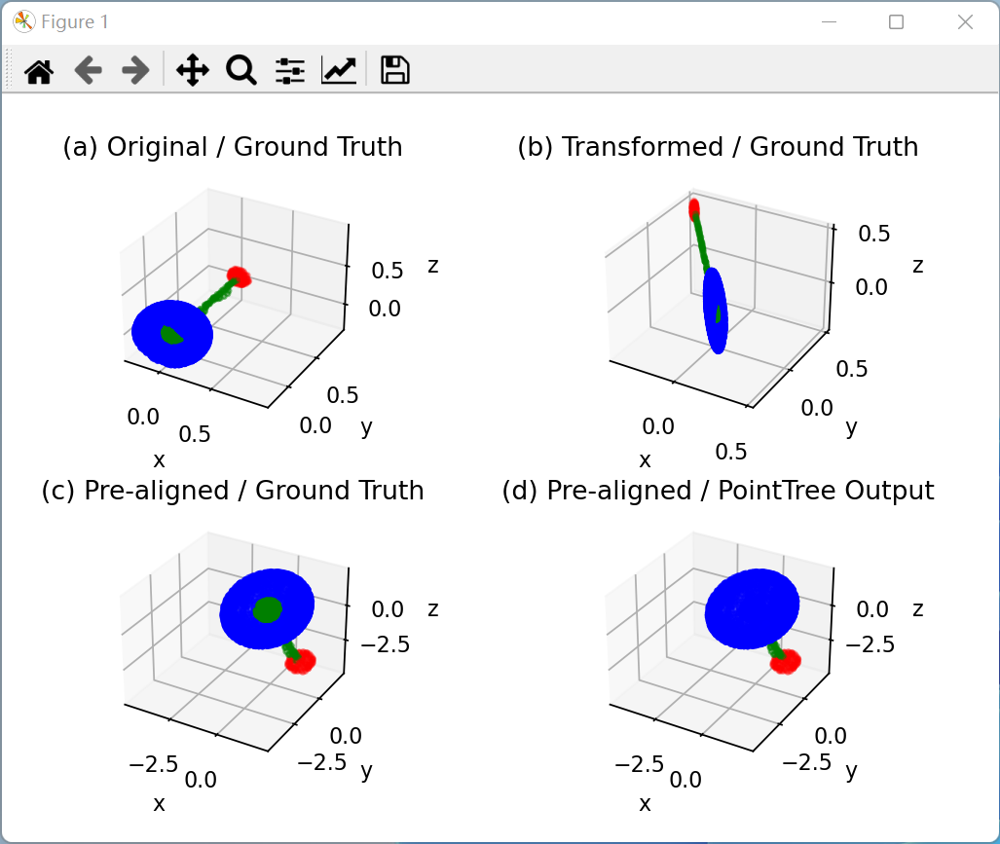

### Demo of PointTree

This folder is an interactive demo of PointTree for the part segmentation task on the affine transformed ShapeNetPart dataset. 

#### How to Run the Demo

To run this demo, you should have Python 3 and the latest `numpy` and `matplotlib` installed by running the following command:

```bash
pip install numpy matplotlib
```

Then use the following command in this folder:

```bash
python show.py <name: car|chair|guitar|lamp|motorbike|pistol|table>
```

For example, if you want to see the demo of a point cloud of a `lamp`, please run:

```bash
python show.py lamp
```

If you are using a Mac computer, please replace `python` and `pip` in the commands above with `python3` and `pip3` to use Python 3 explicitly, i.e., you should use following commands on a Mac computer:

```bash
pip3 install numpy matplotlib
python3 show.py <name: car|chair|guitar|lamp|motorbike|pistol|table>
```

#### How to Use the Demo

After running this command, you will see a window with 4 point clouds, as below. This is the first visualization of Figure 7 in our paper.



In a point cloud, different colors represent different parts in a given part segmentation. The 4 point clouds are:

- (a) The original point cloud colored with ground truth segmentation.
- (b) The affine transformed point cloud colored with ground truth segmentation.
- (c) The pre-aligned point cloud (after affine transformation) colored with ground truth segmentation.
- (d) The pre-aligned point cloud (after affine transformation) colored with segmentation of PointTree's output (the input is the pre-aligned point cloud).

You can drag each point cloud to rotate them and check them in different point of views.